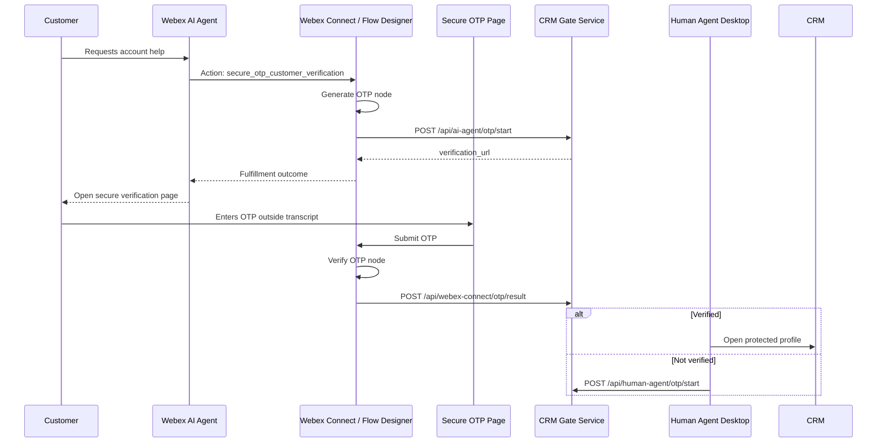

# Architecture

## Components

- Webex AI Agent action: Collects the needed slots and starts fulfillment.
- Webex Connect or Flow Designer: Generates the OTP, verifies the OTP, and returns only the result.
- Secure OTP Page: Receives the OTP directly from the customer outside the AI Agent transcript.
- CRM Gate Service: Owns the audit status and CRM release decision.
- CRM: Opened only when the service returns `verification_status=verified`.

## Production Hardening

- Persist sessions and audit events in an approved database.
- Add rate limits by customer ID, contact ID, and agent ID.
- Enforce mutual TLS or private networking between Webex fulfillment and the service where possible.
- Add a case ID or contact session ID to every request and audit row.
- Mask customer identifiers in logs.
