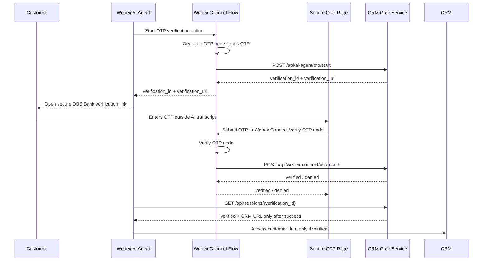

# Secure OTP Page Flow

This flow keeps the OTP out of the AI Agent transcript and lets Webex Connect own OTP generation and verification.

## Conversation

```text
Customer:
Can you look at my account and tell me my balance and transactions?

Virtual Agent:
I can help with that. For your security, please complete verification on the secure DBS Bank page. I will not ask you to share the code in this chat.
```

## Technical Flow



## Webex Action Response

The AI Agent should receive only this kind of response:

```json
{
  "verification_status": "pending",
  "verification_id": "session-id",
  "verification_url": "https://demo.example.com/verify.html?id=session-id",
  "crm_url": null
}
```

After the customer enters the OTP on the secure page:

```json
{
  "verification_status": "verified",
  "verification_id": "session-id",
  "crm_url": "https://crm.example-bank.internal/customer/CUST-48291"
}
```

## Webex Connect Responsibilities

- Generate the OTP with the Webex Connect Generate OTP node.
- Deliver the OTP to the registered mobile number.
- Verify the OTP with the Webex Connect Verify OTP node.
- Return `verified`, `denied`, or `pending` to the secure page.
- Send only the final status to this service:

```http
POST /api/webex-connect/otp/result
Authorization: Bearer ${AGENT_SHARED_SECRET}
Content-Type: application/json
```

```json
{
  "verification_id": "session-id",
  "verification_status": "verified"
}
```

The OTP itself should not be sent to the AI Agent, transcript, CRM, or this service's audit logs.

## Secure Page Configuration

Set the Webex Connect verification endpoint with `WEBEX_CONNECT_VERIFY_URL`:

```text
WEBEX_CONNECT_VERIFY_URL=https://your-webex-connect-endpoint.example/verify-otp
```

For local demos with `npm run dev`, the secure page uses `/api/mock-webex-connect/otp/verify`. OTP `1234` verifies successfully.

The page posts:

```json
{
  "verification_id": "session-id",
  "otp": "1234"
}
```

That endpoint should use the Webex Connect Verify OTP node, then call `/api/webex-connect/otp/result` with only the final status.
