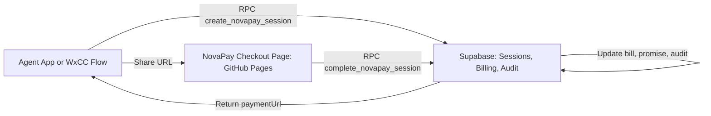

# NovaPay Mock Payment Service

NovaPay is a mock payment service for Webex Contact Center demos. In this GitHub Pages version, the AI Agent creates a payment session in Supabase, sends the generated checkout URL to a customer, and the static checkout page completes the mock payment through Supabase RPC functions.

## Architecture



## Files

```text
NovaPay Service/
  backend/frontend/index.html
  supabase/novapay-github-pages.sql
```

## GitHub Pages Setup

1. Run [supabase/novapay-github-pages.sql](/Users/shailesh/DevProjects/MyWxCCDemo/NovaPay%20Service/supabase/novapay-github-pages.sql) in Supabase SQL Editor.
2. Enable GitHub Pages for this repository.
3. Use this checkout page URL:

```text
https://<your-org>.github.io/<your-repo>/NovaPay%20Service/backend/frontend/index.html
```

The current page is configured for:

```text
https://yrirrlfmjjfzcvmkuzpl.supabase.co/rest/v1
```

## APIs

### Create Session From AI Agent

Call Supabase RPC `create_novapay_session`.

```json
{
  "p_customer_id": 1,
  "p_credit_card_id": 12,
  "p_bill_id": 7,
  "p_promise_id": 1,
  "p_phone_number": "6587414102",
  "p_card_last4": "2201",
  "p_customer_email": "wxccrtmsdemo@gmail.com",
  "p_amount": 486.64,
  "p_payment_page_url": "https://<your-org>.github.io/<your-repo>/NovaPay%20Service/backend/frontend/index.html"
}
```

Response:

```json
{
  "session_id": "uuid",
  "session_token": "token",
  "payment_url": "https://.../index.html?sessionId=uuid&token=token"
}
```

The checkout page calls `get_novapay_session` and `complete_novapay_session` directly.

## Collections Flow

For the payment reminder campaign, the AI Agent should:

1. Look up the customer and unpaid bill by `customers.mobile_no2`.
2. Call `create_novapay_session` with the bill context:

```json
{
  "p_customer_id": 1,
  "p_credit_card_id": 12,
  "p_bill_id": 7,
  "p_promise_id": 1,
  "p_phone_number": "6587414102",
  "p_card_last4": "2201",
  "p_customer_email": "wxccrtmsdemo@gmail.com",
  "p_amount": 486.64,
  "p_payment_page_url": "https://<your-org>.github.io/<your-repo>/NovaPay%20Service/backend/frontend/index.html"
}
```

3. Send the returned `paymentUrl` to the customer.
4. On completion, NovaPay marks the bill as `Paid`, marks the promise as `Kept`, and writes a `Payment Completed` audit event.

## Demo Note

This is a mock payment service only. Do not use it to collect real payment card data.
